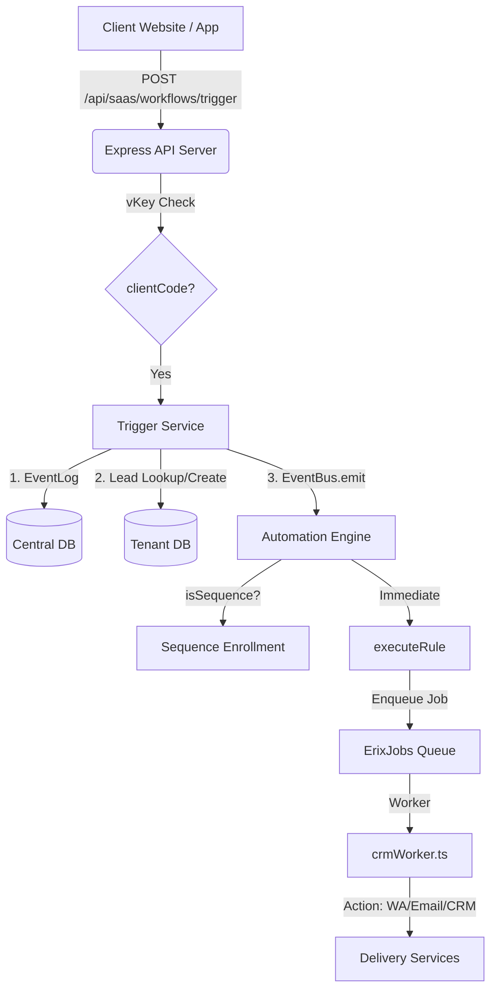
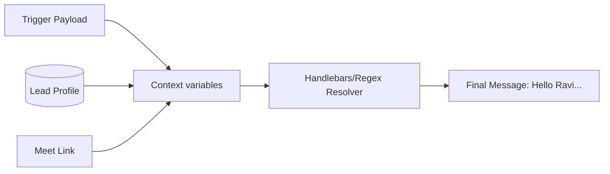
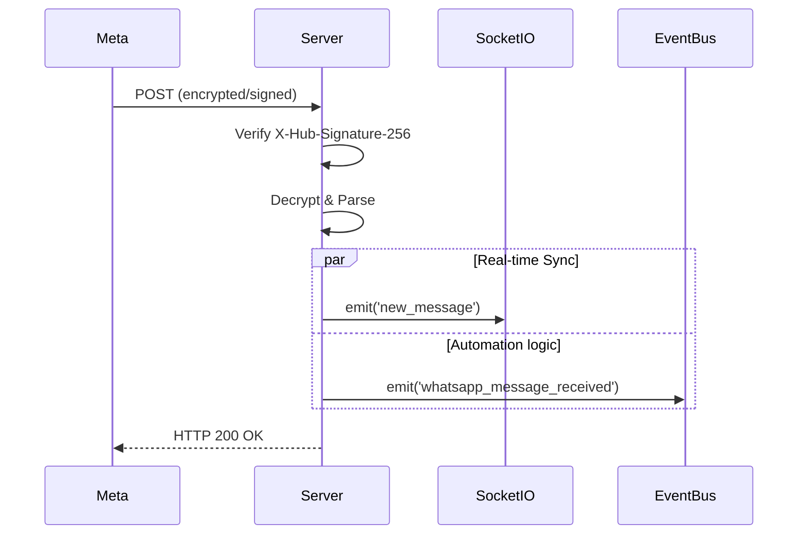

<div align="center">
  
</div>

# ECODrIx Backend — Architecture Guide

This document describes the technical design of the ECODrIx multi-tenant automation engine.

---

## 1. High-Level Overview

ECODrIx is an **API-first, multi-tenant business automation platform** built around a clear separation of concerns:

- **Central Database** (`services`) — global system config, credentials, jobs
- **Tenant Databases** (dynamic, one per client) — CRM, conversations, automations, templates
- **Background Worker** (`ErixWorker`) — single centralized queue for all async jobs
- **Express API Layer** — all routes scoped and isolated by `clientCode`
- **Real-time Layer** — Socket.IO for WhatsApp inbox updates



---

## 2. Multi-Tenancy Architecture

### Dual-Database Strategy

| Database                 | Connection                        | Contents                                                                                                                          |
| ------------------------ | --------------------------------- | --------------------------------------------------------------------------------------------------------------------------------- |
| **Central** (`services`) | Default Mongoose connection       | `Client`, `ClientDataSource`, `ClientSecrets`, `Job`, `EventLog`, `CallbackLog`, `CorsOrigin`                                     |
| **Tenant** (dynamic)     | `getTenantConnection(clientCode)` | `Lead`, `Pipeline`, `PipelineStage`, `Conversation`, `Message`, `Template`, `AutomationRule`, `Activity`, `LeadNote`, `Broadcast`, `EmailCampaign` |

### Tenant Connection Management

`src/lib/connectionManager.ts` maintains a pooled connection cache keyed by `clientCode`. Each new client gets a dedicated MongoDB URI — loaded from `ClientDataSource` in the central database.

```typescript
// Always use this pattern:
const tenantConn = await getTenantConnection(clientCode);
const Lead = getTenantModel(tenantConn, "Lead", schemas.leads);
```

#### Shared models vs Tenant models
- **Shared Models**: (e.g. `Client`, `ClientSecrets`) live in the `services` database. Accessible via default mongoose connection.
- **Tenant Models**: (e.g. `Lead`, `AutomationRule`) live in the client's own database. MUST be accessed via `getCrmModels(clientCode)`.

### CRM Model Shortcut

`getCrmModels(clientCode)` is a convenience wrapper for the common CRM models:

```typescript
const { Lead, Pipeline, AutomationRule, EventLog } = await getCrmModels(clientCode);
```

> [!CAUTION]
> **Never** call `mongoose.model()` on the default connection for tenant data. The default connection points to the central DB. Using it for a tenant model will silently create collections in `services`, mixing data across tenants and bypassing security filters.

---

## 3. API Layer Structure

All routes live in `src/routes/`. The mount point in `server.ts` determines auth:

| Route group                        | Mount            | Auth middleware                        |
| ---------------------------------- | ---------------- | -------------------------------------- |
| `GET /api/saas/health`             | `healthRouter`   | None (public)                          |
| `POST /api/saas/workflows/trigger` | `triggerRouter`  | `validateClientKey` + `triggerLimiter` |
| `/api/saas/chat/*`                 | `chatRouter`     | `validateClientKey`                    |
| `/api/saas/whatsapp/*`             | `webhookRouter`  | `validateClientKey`                    |
| `/api/crm/*`                       | `crmRouter`      | `validateClientKey`                    |
| `/api/saas/events/*`               | `eventLogRouter` | `validateClientKey`                    |
| `/api/clients/*`                   | `clientsRouter`  | `verifyCoreToken` (admin only)         |

### Rate Limiting

- **Global:** `limiter` — applied to all `/api/*` routes
- **Trigger endpoint:** `triggerLimiter` — stricter 60 req/min/tenant, uses `ipKeyGenerator` helper for IPv6 safety

---

## 4. Trigger → Automation Flow (Step by Step)

When `POST /api/saas/workflows/trigger` is called:

```
1. validateClientKey middleware → sets req.clientCode
2. triggerLimiter → rate check (IP-based protection)
3. trigger.routes.ts:
   a. Create EventLog { status: "received" }
   b. lead.service.getLeadByPhone() → check existence
      └─ if createLeadIfMissing: createLead() with source: "webhook"
   c. Dynamic Trigger Mapping: Check CustomEventDef for renames (e.g. "contact_form" -> "lead_created")
   d. Count matching AutomationRule documents in tenant DB
   e. Build Unified Context:
      - lead.*: All standard lead fields
      - event.*: Variables passed in the POST body
      - data.*: Structured data from the POST body
   f. EventBus.emit() → The core orchestrator
      - Normal triggers: Immediate execution
      - Scheduled triggers (runAt/delaySeconds): Enqueue in ErixJobs
   g. Update EventLog { status: "completed", rulesMatched }
   h. Return response with leadId and eventLogId
```

---

## 5. Automation Engine

### Rule Matching (`automation.service.ts → runAutomations`)

1. Queries `AutomationRule` with `clientCode + trigger + isActive: true`
2. Applies optional `condition` check against lead fields
3. For each matching rule:
   - If `isSequence`: enroll lead in multi-step sequence
   - Else: `executeRule()` → enqueue each action via `enqueueDelayedAction()`

### Action Execution (`executeAction`)

Actions are executed by `crmWorker.ts` pulling from the `ErixJobs` queue. Each action handler:

| Action type              | What happens                                                                                               |
| ------------------------ | ---------------------------------------------------------------------------------------------------------- |
| `send_whatsapp`          | Resolves template variables from lead context + event variables → `whatsapp.service.sendOutboundMessage()` |
| `send_email`             | `email.service.sendEmail()` via SMTP/SES with compliance gate injection                      |
| `move_stage`             | `lead.service.moveLead()` → fires `stage_enter`/`stage_exit` hooks                                         |
| `assign_to`              | Direct field update + activity log                                                                         |
| `add_tag` / `remove_tag` | `lead.service.updateTags()` → fires `tag_added`/`tag_removed` hooks                                        |

### Context Variable Resolution

The `VariableResolver` (in `src/lib/variableResolver.ts`) manages data injection for templates:



1. **Lead Layer**: `{{lead.firstName}}`, `{{lead.dealValue}}` etc.
2. **Event Layer**: `{{event.productName}}` (from POST body).
3. **Derived Layer**: `{{resolved.meetLink}}`, `{{resolved.today}}`.

---

## 7. WhatsApp Infrastructure

### Webhook Flow (Ingestion)

When Meta sends a webhook to `/api/saas/whatsapp/webhook`:



---

## 8. Background Job System

### Erix Jobs (`src/lib/erixJobs/`)

A custom lightweight polling queue backed by MongoDB (formerly MongoQueue). No Redis dependency.

- **Poll interval:** 5000ms
- **Concurrency:** 3 workers per process
- **Job persistence:** jobs survive server restarts
- **Retry:** built-in retry with exponential backoff

### crmWorker.ts — Centralized Job Handler (Erix Worker)

All tenant jobs route through a single worker:

```
crm.automation_event   → runAutomations()
crm.send_whatsapp      → executeAction()
crm.send_broadcast_msg → whatsapp.service.sendOutboundMessage()
crm.send_email         → email.service.sendEmail()
crm.email_marketing    → emailMarketing.handler.ts (bulk send)
crm.google_meet        → googleMeet.service.createMeeting()
```

This eliminates idle per-tenant workers and makes monitoring trivial — one queue, one view.

---

## 7. Directory Structure

```
src/
├── jobs/
│   ├── cron.ts                 ← scheduled jobs (no_contact, score recalc, etc.)
│   └── saas/
│       └── crmWorker.ts        ← THE central job handler
│
├── lib/
│   ├── connectionManager.ts    ← tenant connection pool
│   ├── erixJobs/               ← custom queue (poll-based, no Redis)
│   ├── callbackSender.ts       ← HMAC-signed webhook delivery with retry
│   └── tenant/
│       └── get.crm.model.ts    ← safe tenant model accessor
│
├── middleware/
│   ├── saasAuth.ts             ← validateClientKey
│   ├── auth.ts                 ← verifyCoreToken (admin)
│   └── rate-limit.ts           ← global + trigger-specific limiters
│
├── model/
│   ├── clients/                ← central DB models (Client, Secrets, DataSource)
│   └── saas/
│       ├── crm/                ← tenant CRM models (Lead, Pipeline, etc.)
│       ├── whatsapp/           ← tenant WA models (Conversation, Message, Template)
│       └── event/              ← central telemetry (EventLog, CallbackLog)
│
├── routes/
│   ├── saas/
│   │   ├── crm/                ← /api/crm/* (leads, pipelines, automations, analytics)
│   │   ├── whatsapp/           ← /api/saas/whatsapp/* + /api/saas/chat/*
│   │   ├── workflows/          ← /api/saas/workflows/trigger
│   │   ├── health.routes.ts    ← /api/saas/health
│   │   └── eventLog.routes.ts  ← /api/saas/events/* + callbacks
│   └── services/
│       └── clients.ts          ← /api/clients/* (admin)
│
└── services/
    └── saas/
        ├── crm/                ← lead, pipeline, automation, scoring, analytics
        ├── whatsapp/           ← whatsapp.service, template.service
        ├── mail/               ← email.service (strict domain-first SES onboarding)
        ├── meet/               ← google.meet.service
        └── media/              ← media.service (image/video optimization)
```

---

## 8. Security Model

1. **Tenant isolation** — every query includes `clientCode` as a hard filter
2. **Model isolation** — tenant models only registered on tenant connections
3. **Auth layers**:
   - `validateClientKey` — verifies API key against `ClientSecrets`, attaches `clientCode` to `req`
   - `verifyCoreToken` — admin-only JWT for internal management routes
4. **Rate limiting** — IPv6-safe via `ipKeyGenerator`
5. **Callback signing** — all outbound webhooks HMAC-signed with `automationWebhookSecret`
6. **CORS** — dynamic allowlist via `CorsOrigin` model, managed via admin API

---

## 9. Developer Rules

1. **Never use the default Mongoose connection for tenant data.** Always `getTenantConnection(clientCode)`.
2. **Never export compiled models from `tenant.schemas.ts`.** Only export schema definitions (e.g., `ConversationSchema`).
3. **Automation failures must never crash the primary request.** Wrap `runAutomations` calls in try/catch or use `void fireAutomations()`.
4. **All routes return the unified `{ success, data, message }` envelope.**
5. **All tenant queries must include `clientCode` as a filter field.** Never query across tenants accidentally.
